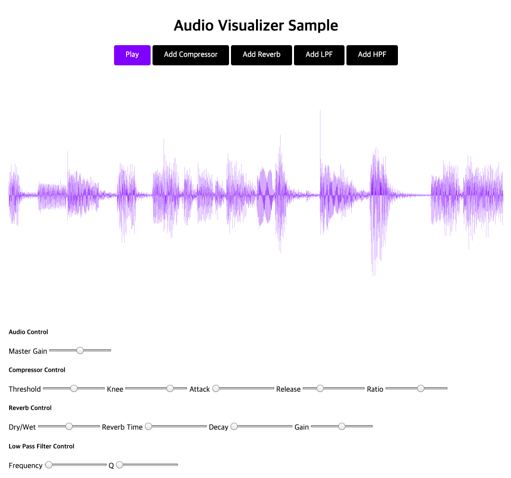

# web-audio-editor
JavaScript AudioContext API과 SVG를 사용하여 WaveForm를 렌더하고 몇가지 이펙터를 간단히 만들어보는 실험실.

## Live Demo


[Live Demo](https://evan-moon.github.io/simple-waveform-visualizer/)는 여기서 확인하실 수 있습니다.

## Usage
```bash
$ npm run dev # 개발서버
$ npm run build # 빌드
$ npm start # Express로 띄우기
```

