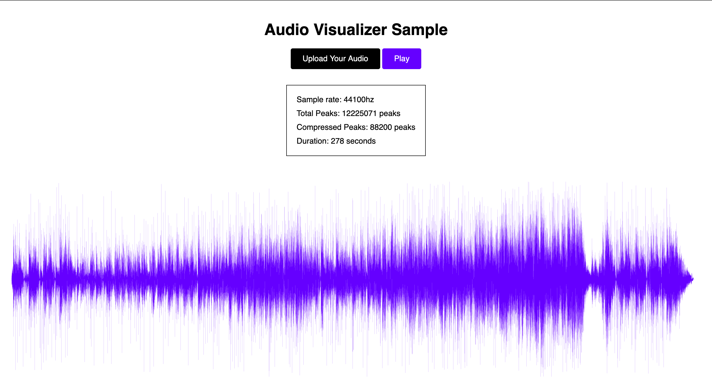

# simple-waveform-visualizer
JavaScript AudioContext API과 SVG를 사용하여 WaveForm를 렌더하고 몇가지 이펙터를 간단히 만들어보는 실험실.

## Live Demo


[Live Demo](https://simple-audio-waveform.herokuapp.com/)는 여기서 확인하실 수 있습니다.

## TODO
### View
- <strike>WaveForm</strike>
### Effects
- <strike>Compressor</strike>
- <strike>Reverb</strike>
- Delay
- Limiter
- <strike>Filter (LPF, HPF)</strike>
- EQ
- Distortion
- Tremolo
### Framework
- Vue? React? 뭘로 할지 고민 중... 일단 모듈 개발부터 대충 끝내놓고 도입할 예정

## Usage
```bash
$ npm run dev # 개발서버
$ npm run build # 빌드
$ npm start # Express로 띄우기
```

